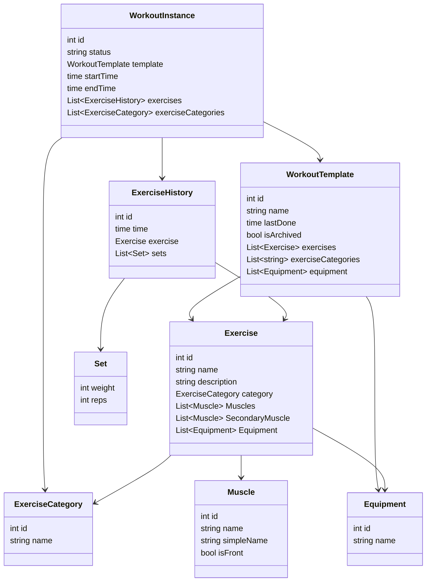

```mermaid
classDiagram
    WorkoutTemplate --> Exercise
    WorkoutTemplate --> Equipment
	WorkoutInstance --> WorkoutTemplate
	WorkoutInstance --> ExerciseHistory
	WorkoutInstance --> ExerciseCategory
	Exercise --> ExerciseCategory
	Exercise --> Muscle
	Exercise --> Equipment
	ExerciseHistory --> Exercise
	ExerciseHistory --> Set
	class WorkoutTemplate {
		int id
		string name
		time lastDone
        bool isArchived
		List~Exercise~ exercises
		List~string~ exerciseCategories
		List~Equipment~ equipment
	}
	class WorkoutInstance {
		int id
		string status
		WorkoutTemplate template
		time startTime
		time endTime
		List~ExerciseHistory~ exercises
		List~ExerciseCategory~ exerciseCategories
	}
	class Exercise {
        int id
        string name
        string description
        ExerciseCategory category
        List~Muscle~ Muscles
        List~Muscle~ SecondaryMuscle
        List~Equipment~ Equipment
    }
    class ExerciseCategory {
        int id
        string name
    }
    class Equipment {
        int id
        string name
    }
    class Muscle {
        int id
        string name
        string simpleName
        bool isFront
    }
	class ExerciseHistory {
		int id
		time time
		Exercise exercise
		List~Set~ sets
	}
	class Set {
		int weight
		int reps
	}

```